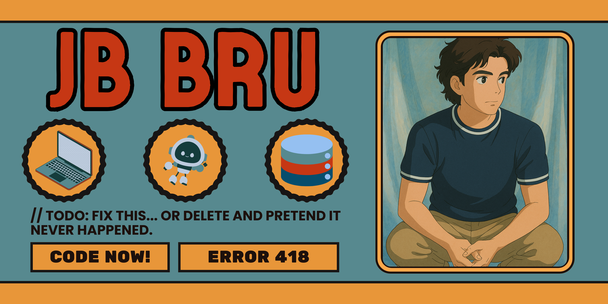

# 💫 About Me:

🌍 From a small island called Mauritius to building software in Malaysia, I’ve always seen technology as a bridge to bigger opportunities. Currently a final-year Software Engineering student, I specialise in full-stack development with a focus on creating interactive, user-friendly applications that solve real problems.

💻 My experience spans:

Frontend: React, JavaScript, HTML/CSS, UI/UX principles, performance optimisation

Backend: Python (FastAPI), Node.js, REST APIs, SQL/NoSQL databases

Other: Agile teamwork, Git, cloud deployment, AI-powered features (OCR, LLM integration)

🚀 Highlights so far:

Built a [Budget Tracker](https://budget-tracker.jbbru.com/) app with AI-powered receipt scanning, combining front-end usability with backend scalability.

Placed 2nd at ImagineHack, developing a virtual pet system called [PengYou](https://pengyou.spimy.dev/) that uses large language models to provide personalised financial nudges.

Explored Scala and game development, sharpening my problem-solving and systems thinking.

✨ What drives me is building applications people want to use — tools that are both functional and enjoyable. Whether it’s experimenting with AI features, contributing to hackathons, or refining UI for smoother experiences, I’m passionate about turning ideas into working solutions.

📌 Currently seeking internship opportunities in software engineering and product development (January–April 2026) where I can apply my skills, learn from inspiring teams, and contribute to meaningful projects.

<!--# 🌐 Socials:

 -->

# 💻 Tech Stack:

                     <!--   -->    <!-- -->  <!---->  <!---->  

# 🐍 Say hi to Bobbeh Da Snake!

<picture>
  <source media="(prefers-color-scheme: dark)" srcset="https://raw.githubusercontent.com/JBBru-helloworld/JBBru-helloworld/output/github-snake-dark.svg" />
  <source media="(prefers-color-scheme: light)" srcset="https://raw.githubusercontent.com/JBBru-helloworld/JBBru-helloworld/output/github-snake.svg" />
  
</picture>

# 📊 GitHub Stats:

 
 

# 🏆 GitHub Trophies

---

